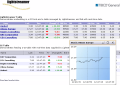
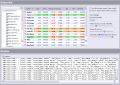
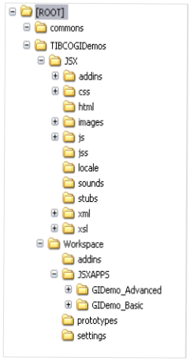

# Lightstreamer - Stock-List Demos - HTML (General Interface) Clients #

This project contains two demos client showing integration between Lightstreamer and [TIBCO General Interface](http://developer.tibco.com/gi/default.jsp).

## Stock-List Demo - HTML (General Interface) Client ##
<!-- START DESCRIPTION lightstreamer-example-stocklist-client-gi-stock-list-demo---html-general-interface-client -->

<table>
  <tr>
    <td style="text-align: left">
      &nbsp;&nbsp;
    </td>
    <td>
      &nbsp;An online demonstration is hosted on our servers at: 
      &nbsp;<a href="http://demos.lightstreamer.com/TIBCOGIDemos/Workspace/JSXAPPS/GIDemo_Basic/" target="_blank">http://demos.lightstreamer.com/TIBCOGIDemos/Workspace/JSXAPPS/GIDemo_Basic/</a>
    </td>
  </tr>
</table>

This application uses the <b>JavaScript Client API for Lightstreamer</b> to handle the communications with Lightstreamer Server and uses the <b>General Interface API</b> to display the real-time data. 

In this application, five stock quotes are displayed in real time. The demo page contains two tables, both of which receive the real-time data flow from Lightstreamer Server. The table at the top is managed by the Lightstreamer JavaScript Client, though embedded inside GI. The table at the bottom is a GI table (in which you can drag, resize and sort columns) and is updated by the Lightstreamer Javascript Client. GI-based pop-up windows show the price charts produced by the Lightstreamer JavaScript Client. 

The demo includes the following client-side technologies:
* A [Subscription](http://www.lightstreamer.com/docs/client_javascript_uni_api/Subscription.html) containing 10 items, subscribed to in <b>MERGE</b> mode feeding both a [StaticGrid](http://www.lightstreamer.com/docs/client_javascript_uni_api/StaticGrid.html) and the GI widget.
* For each pop-up window opened, a [Subscription](http://www.lightstreamer.com/docs/client_javascript_uni_api/Subscription.html) containing 1 item, subscribed to in <b>MERGE mode</b> feeding a [Chart](http://www.lightstreamer.com/docs/client_javascript_uni_api/Chart.html).

<!-- END DESCRIPTION lightstreamer-example-stocklist-client-gi-stock-list-demo---html-general-interface-client -->

## Advanced Stock-List Demo - HTML (General Interface) Client ##
<!-- START DESCRIPTION lightstreamer-example-stocklist-client-gi-advanced-stock-list-demo---html-general-interface-client -->

<table>
  <tr>
    <td style="text-align: left">
      &nbsp;&nbsp;
    </td>
    <td>
      &nbsp;An online demonstration is hosted on our servers at: 
      &nbsp;<a href="http://demos.lightstreamer.com/TIBCOGIDemos/Workspace/JSXAPPS/GIDemo_Advanced/" target="_blank">http://demos.lightstreamer.com/TIBCOGIDemos/Workspace/JSXAPPS/GIDemo_Advanced/</a>
    </td>
  </tr>
</table>

This application uses the <b>JavaScript Client API for Lightstreamer</b> to handle the communications with Lightstreamer Server; uses <b>PageBus</b> as a bridge between Lightstreamer and General Interface APIs; and uses the <b>General Interface API</b> to display the real-time data. 

The Lightstreamer client receives events from Lightstreamer Server and publishes the stock updates on TIBCO PageBus. The application, created with the GI Builder, subscribes to the PageBus in order to receive and display the updates to the user. 

A [detailed explanation](http://demos.lightstreamer.com/TIBCOGIDemos/Workspace/JSXAPPS/GIDemo_Advanced/GI-AMS%20Demo.pdf) of this application is available (in that document Lightstreamer is referred to as "Ajax Message Service"). 

The demo includes the following client-side technologies:
* A [Subscription](http://www.lightstreamer.com/docs/client_javascript_uni_api/Subscription.html) for each item added to the update panel, subscribed to in <b>MERGE</b> mode.

<!-- END DESCRIPTION lightstreamer-example-stocklist-client-gi-advanced-stock-list-demo---html-general-interface-client -->

## How to edit the demos with GI Builder ##

Copy the application folder (for example "GIDemo_Basic" or "GIDemo_Advanced") to the JSXAPPS folder of your GI Builder workspace. 
Launch GI Builder and select the copied application folder.

# Deploy #

 To deploy the demo on a new Web Server, set up a folder structure like that shown above.
[ROOT] is the Web Server root folder or any subfolder under which to install the Demo. JSX contains the GI libraries. The "addins", "prototypes", and "settings" folders under "Workspace" don't need to contain anything special. 
Make sure to set the correct host name and port in the JavaScript code specific of each Demo (for example, "giclient.js" for the GIDemo_Advanced, or "lslogic.js" for the GIDemo_Basic). 
The next step is to complete your installation of the demo with a valid version of the Lightstreamer JavaScript Client API library. 
You can get the lib from here: "\DOCS-SDKs\sdk_client_javascript\alternative_libs\" and copy the file named lightstreamer_globals.js into the folder commons. 
Launch the demo by downloading the index.html file from the desired Demo folder unser JSXAPPS (for example: http://www.mycompany.com/TIBCOGIDemos/Workspace/JSXAPPS/GIDemo_Basic/ )

# See Also #

## Lightstreamer Adapters needed by these demo clients ##
<!-- START RELATED_ENTRIES -->

* [Lightstreamer - Stock-List Demo - Java Adapter](https://github.com/Weswit/Lightstreamer-example-Stocklist-adapter-java)
* [Lightstreamer - Reusable Metadata Adapters - Java Adapter](https://github.com/Weswit/Lightstreamer-example-ReusableMetadata-adapter-java)

<!-- END RELATED_ENTRIES -->

## Similar demo clients that may interest you ##

* [Lightstreamer - Stock-List Demos - HTML Clients](https://github.com/Weswit/Lightstreamer-example-Stocklist-client-javascript)
* [Lightstreamer - Basic Stock-List Demo - jQuery Client](https://github.com/Weswit/Lightstreamer-example-StockList-client-jquery)
* [Lightstreamer - Stock-List Demo - Dojo Toolkit Client](https://github.com/Weswit/Lightstreamer-example-StockList-client-dojo)
* [Lightstreamer - Stock-List Demos - Flex Clients](https://github.com/Weswit/Lightstreamer-example-StockList-client-flex)
* [Lightstreamer - Basic Stock-List Demo - Java SE (Swing) Client](https://github.com/Weswit/Lightstreamer-example-StockList-client-java)
* [Lightstreamer - Basic Stock-List Demo - .NET Client](https://github.com/Weswit/Lightstreamer-example-StockList-client-dotnet)
* [Lightstreamer - Basic Stock-List Demo - Silverlight Client](https://github.com/Weswit/Lightstreamer-example-StockList-client-silverlight)

# Lightstreamer Compatibility Notes #

- Compatible with Lightstreamer JavaScript Client library version 6.0 or newer.
